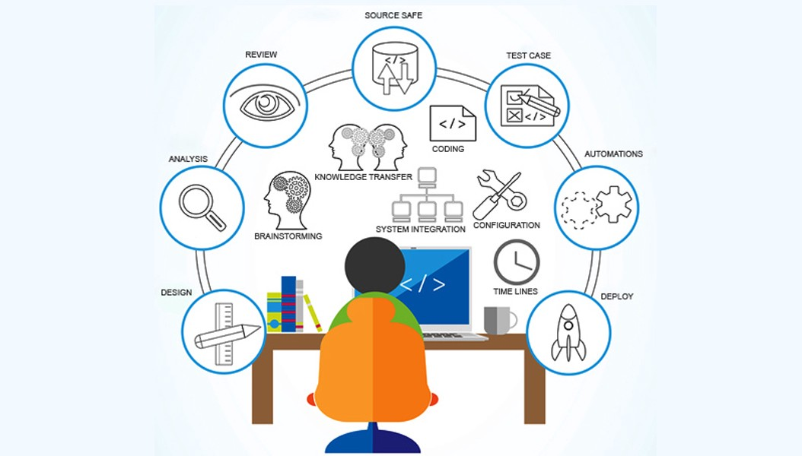

<h1 align="center">
	
	 
	 
</h1>

# Awesome Testing Tools

## Table of contents
 * [Automated Testing Tools](https://github.com/ZoranPandovski/awesome-testing-tools#automated-testing-tools)
 * [Load Testing Tools](https://github.com/ZoranPandovski/awesome-testing-tools#load-testing-tools)
 * [Mobile Testing Tools](https://github.com/ZoranPandovski/awesome-testing-tools#mobile-testing-tools)
 * [Penetration Testing Tools](https://github.com/ZoranPandovski/awesome-testing-tools#penetration-testing-tools)
 * [Test Observability Tools](https://github.com/ZoranPandovski/awesome-testing-tools#test-observability-tools)
 * [Web3 and Blockchain Testing Tools](https://github.com/ZoranPandovski/awesome-testing-tools#web3-and-blockchain-testing-tools)
 * [Contract Testing Tools](https://github.com/ZoranPandovski/awesome-testing-tools#contract-testing-tools)

## Contributions
If we are missing some awesome testing tool that you already know, follow our [contribution guide](https://github.com/ZoranPandovski/awesome-testing-tools/blob/master/contributing.md) and make PR.

## Automated Testing Tools

| Name | Description | Link | Price |
|---|---|---|---|
| Athena | Athena is an automation platform with a plugin architecture that allows you to easily create and share services | https://athena-oss.github.io/ | Free |
| Ava | AVA is a test runner for Node.js with a concise API, detailed error output, embrace of new language features and process isolation that let you write tests more effectively. So you can ship more awesome code. | https://github.com/avajs/ava | Free |
| BugBug | BugBug is a lightweight test automation tool designed exclusively for web applications. It uses a Chrome extension to record and playback tests. It's free, you only need to pay if you want to schedule cloud monitoring or integrate it with your CI/CD pipelines. | https://bugbug.io | Free/Paid |
| Checkbot | Browser extension. Tests your site follows 50+ SEO, speed and security best practices. Finds broken links, insecure pages, redirect chains, duplicate content and more. Crawls your site checking multiple pages at once. | https://www.checkbot.io/ | Free/Paid |
| Cucumber | Cucumber is an open-source tool that supports Behaviour-Driven Development (BDD). The tests are written in [Gherkin](https://docs.cucumber.io/gherkin/). Cucumber integrates nicely with Selenium WebDriver, Serenity BDD, Watir and Capybara. | https://docs.cucumber.io/ | Free |
| Cypress | Cypress is a Javascript End-to-End testing framework. It allows you to run e2e tests effortlessly (no need to do a Java/Selenium setup in order to use it) with features such as debugging with Chrome DevTools and screenshots for tests run headlessly. The documentation is good and comes with many examples. | https://www.cypress.io/ | Free/Paid |
| GoCodeo | GoCodeo is your ultimate AI-powered extension for coding and testing in Visual Studio Code. Generate production-ready code and tests in seconds, and leverage the power of the latest AI models, including cutting-edge Large Language Models (LLMs) like Claude Sonnet 3.5, GPT - 4o, GPT - 4o mini, Gemini 1.5 Flash, Gemini 1.5 Pro, without any cost. | https://www.gocodeo.com | Free/Paid |
| HttpMaster | HttpMaster is a GUI tool for HTTP testing and debugging. | https://www.httpmaster.net/ | Free/paid |
| Instancio | Instancio is an open-source library for automating data setup in unit tests. It can create fully-populated POJOs with a single method call. Instancio can be used with any testing framework. It also provides a JUnit 5 extension. | https://www.instancio.org/ | Free |
| JUnit | JUnit is an open-source unit testing framework for the Java programming language. JUnit has been important in the development of test-driven development and is one of a family of unit testing frameworks which is collectively known as xUnit. | https://junit.org/ | Free |
| Karate | Karate is the open-source tool to combine API test-automation, mocks, performance-testing and even UI automation into a single, unified framework. The BDD syntax popularized by Cucumber is language-neutral, and easy for even non-programmers. Assertions and HTML reports are built-in, and you can run tests in parallel for speed. | https://github.com/karatelabs/karate | Free |
| Karma | Karma can also watch your development files for changes and re-run the tests automatically. Karma lets us run jasmine tests as part of a development tool chain which requires tests to be runnable and results inspectable via the command line. It's not necessary to know the internals of how Karma works. | https://karma-runner.github.io | Free |
| Katalon Studio | Katalon Studio is a powerful test automation solution for web application, mobile, and web services. Being built on top of the Selenium and Appium frameworks, Katalon Studio takes advantage of these solutions for integrated software automation. | https://www.katalon.com/ | Free |
| LambdaTest | LambdaTest is a cloud-based cross-browser testing platform that allows you to test your website or web application on 2000+ real browsers and operating systems. It is a fully managed platform that requires no setup or maintenance. | https://www.lambdatest.com/ | Free/Paid |
| Mocha | Mocha is open-source JavaScript Testing Framework that runs on Node.js | https://mochajs.org/ | Free |
| Mockito | Mockito is a mocking framework that lets you write tests with a clean & simple API. Mockito's tests are very readable and they produce clean verification errors. | https://site.mockito.org | Free |
| Nightwatch.js | Nightwatch.js is an integrated framework for performing automated end-to-end testing on web applications and websites, across all major browsers. It is written in Node.js and uses the W3C WebDriver API to interact with various browsers. | https://v2.nightwatchjs.org | Free |
| Panaya Test Dynamix | With Test Dynamix, you can quickly manage tests with automatic workflows, easy documentation, real-time analytics, and smart change analysis. | https://www.panaya.com/testing/ | Free/paid |
| PestPHP | The elegant PHP testing framework. Pest is a testing framework with a focus on simplicity, meticulously designed to bring back the joy of testing in PHP. | https://pestphp.com/ | Free |
| Phpstan | PHPStan focuses on finding errors in your code without actually running it. It catches whole classes of bugs even before you write tests for the code. It moves PHP closer to compiled languages in the sense that the correctness of each line of the code can be checked before you run the actual line. | https://phpstan.org | Free |
| PhpUnit | PHPUnit is a unit testing framework for the PHP programming language. It is an instance of the xUnit architecture for unit testing frameworks that originated with SUnit and became popular with JUnit | https://phpunit.de/ | Free |
| Playwright | Playwright is a framework for end-to-end testing of web applications. The framework supports writing tests in a variety of languages. | https://playwright.dev/ | Free |
| Psalm | Psalm is a static analysis tool for finding errors in PHP applications, built on top of PHP Parser. | https://psalm.dev | Free |
| Puppetry | Puppetry is an open-source scriptless test automation tool built on top of Google’s Puppeteer. It can be used by QA engineers with no programming background. Puppetry can also export the tests into a Jest.js project, so they can be  included into CI/CD pipeline. | https://puppetry.app/ | Free |
| ReadyAPI | ReadyAPI is a paid tool owned by Smartbear. It is used for testing API's. It is built on top of SOAPUI. So it has all the features of SOAPUI and additional features such as support for data-driven testing, SCM friendly project structure, and better assertion capabilities. ReadyAPI is a no-code platfom, but it supports Javascript and Groovy as scripting languages to implement unforseen functionality. | https://smartbear.com/product/ready-api | Paid |
| Robot Framework | Robot Framework is an open-source automation framework that implements the keyword-driven approach for acceptance testing and acceptance test-driven development (ATDD). Robot Framework provides frameworks for different test automation needs. But its test capability can be further extended by implementing additional test libraries. |http://www.robotframework.org/ | Free |
| Selenium | Selenium automates browsers. That's it! What you do with that power is entirely up to you. Primarily, it is for automating web applications for testing purposes, but is certainly not limited to just that. Boring web-based administration tasks can (and should!) be automated as well. | https://www.seleniumhq.org/download/ | Free |
| SilkTest | Test automation for web, mobile, rich-client, and Enterprise applications | https://www.microfocus.com/en-us/products/silk-test/overview| Paid |
| Squish | The GUI Testing Tool for automated functional regression and system testing. Squish supports of all kinds of cross-platform desktop, mobile, embedded and web applications. | https://www.froglogic.com/ | Paid |
| TestCafé | TestCafé is an open-source cross browser end-to-end functional test automation solution for web application. It is a JS based project, and run test suites on any popular browser without adding any additional code. | https://devexpress.github.io/testcafe/ | Free/Paid |
| TestComplete | Create complex and scalable automated UI functional tests in seconds with Record & Playback capabilities. With TestComplete you can trust your recorded tests will always play back - powered by the most accurate and customizable object repository, with 1k Rules Covering 50k properties & 500 controls. | https://smartbear.com/ | Paid |
| Testim | Testim is a modern day automated testing tool. It uses machine learning to speed the authoring, execution, and maintenance of automated tests. The tester can be analysis any test case in few minutes and execute them on multiple web and mobile platforms. | https://www.testim.io/ | Paid |
| Telerik | The complete test automation solution for GUI, Performance, Load and API testing.Test web, mobile and desktop applications. | http://www.telerik.com/ | Paid |
| Unified Functional Testing | Cross-browser and multi-platform,  Optimized distributed testing, Visual test flows (canvas), Multi-testing solution, Image-based object recognition. | https://software.microfocus.com/ | Paid |
| vREST NG | vREST NG is a zero code API automation solution for functional and regression testing of your APIs. It will help you to efficiently develop your test suites using record/replay, excel sheets (data driven testing) and allow you to derive your API testing using Swagger or OpenAPI specs. | https://vrest.io | Free/Paid |
| Watir | Waitr is an open-source cross-platform web application testing tool. It is most reliable and flexible automation tool of Ruby libraries for web browsers automation. This cross browser testing tool interacts with a browser just like human being so it clicks links, filling out forms and validating text. | http://watir.com/ | Free |
| WHITE | White is open-source, written in C# and it supports all rich client applications, which are Win32, WinForm, WPF and SWT (Java). It is .NET based and does not require the use of any proprietary scripting languages. | https://www.codeproject.com/Articles/289028/White-An-UI-Automation-tool-for-windows-applicatio| Free |
| Jest | Jest is open-source Javascript testing framework, written in Typescript and developed by Facebook. It supports testing with Babel, TypeScript, Node, React, Angular, Vue and much more! | https://jestjs.io/ | Free
| The Testing Library | The Testing Library is a set of helpers that let you test several frameworks, including React, Angular, Vue and their components without relying on their implementation details. This approach makes refactoring a breeze and also nudges you towards best practices for accessibility. | https://testing-library.com/ | Free
| GoConvey | GoConvey is a behavior-driven development(BDD)-style testing framework that supports the go test command. It uses an expressive domain-specific language (DSL) that facilitates the creation of self-documenting, highly readable tests. | http://goconvey.co/ | Free
| CodeceptJS | E2E testing framework with a special unificated BDD-style syntax for different frameworks. | https://codecept.io/ | Free
| testomat.io | Modern TCMS allows sync the manual and automated tests in one place. Real-time reporting. Rich analytics dashboard with value testing metrics. | https://testomat.io/ | Free
| Zato API Test | API testing in pure English. No programming needed. Implemented and extendable in Python. | https://zato.io/en/docs/3.2/api-testing/index.html | Free

## Load Testing Tools

| Name | Description | Link | Price |
|---|---|---|---|
| Jmeter | The Apache JMeter™ application is open source software, a 100% pure Java application designed to load test functional behavior and measure performance. It was originally designed for testing Web Applications but has since expanded to other test functions. | http://jmeter.apache.org/ | Free |
| LoadUI | Scriptless Load Testing for REST & SOAP APIs | https://www.soapui.org/ | Paid |
| WAPT | Test the Performance of Web Applications Under Load. | https://www.loadtestingtool.com/ | Free/Paid |
| BlazeMatter | Performance and Load Testing, 100% compatible with Apache JMeter™, 3rd party plugins, and advanced features. Control any aspect of your test in real time. | https://www.blazemeter.com/ | Free/Paid |
| Gatling | Gatling is an open-source load and performance testing framework based on Scala, Akka and Netty. It is known for it's high performance, ready-to-present HTML reports, scenario recorder and developer-friendly DSL. | https://gatling.io/ | Free |
| Locust | Define user behaviour with Python code, and swarm your system with millions of simultaneous users. | https://locust.io/ | Free |
| ApacheBench | ab is a tool for benchmarking your Apache Hypertext Transfer Protocol (HTTP) server. It is designed to give you an impression of how your current Apache installation performs. This especially shows you how many requests per second your Apache installation is capable of serving. | https://httpd.apache.org/docs/2.4/programs/ab.html | Free |
| Grafana K6 | Grafana k6 is an open-source load testing tool that makes performance testing easy and productive for engineering teams. k6 is free, developer-centric, and extensible. | https://k6.io | Free |

## Mobile Testing Tools

| Name | Description | Link | Price |
|---|---|---|---|
| Robotium | Robotium is an open-source test automation tool mainly use for Android UI testing. |  https://robotium.com/pages/free-trial | Free |
| Appium | Appium is an open source test automation framework for use with native, hybrid and mobile web apps. It drives iOS, Android, and Windows apps using the WebDriver protocol. | http://appium.io/ | Free |
| Espresso | Espresso is a mobile testing tool for the enterprises. As an open-source tool, it's very easy to use, and it can extend within that working environment. | [Espresso](https://developer.android.com/training/testing/espresso) | Free |
| Experitest | Perform continuous web and mobile app testing to accelerate release cycles and increase quality. | https://experitest.com/ | Paid |
| Robolectric | Robolectric is an open source test framework for Android. It provides faster unit-testing by running tests inside JVM. | http://robolectric.org/ | Free |
| React Native Testing Library | The React Native Testing Library is a lightweight solution for testing React Native components. It provides light utility functions on top of react-test-renderer, in a way that encourages better testing practices. | https://callstack.github.io/react-native-testing-library/ | Free |
| Maestro | Maestro is the simplest and most effective mobile(Android/iOS) UI testing framework. | https://www.mobile.dev/ | Free |

## Penetration Testing Tools

| Name | Description | Link | Price |
|---|---|---|--|
| Kali Linux | Kali Linux is the new generation of the industry-leading BackTrack Linux penetration testing and security auditing Linux distribution. Kali Linux is a complete re-build of BackTrack from the ground up, adhering completely to Debian development standards. | https://www.kali.org/ | Free |
| MetaSploit | A collaboration between the open source community and Rapid7, Metasploit helps security teams do more than just verify vulnerabilities, manage security assessments, and improve security awareness; it empowers and arms defenders to always stay one step (or two) ahead of the game. |  https://www.metasploit.com/ | Free |
| Wireshark | Wireshark is the world’s foremost and widely-used network protocol analyzer. It lets you see what’s happening on your network at a microscopic level |  https://www.wireshark.org/ | Free |
| NetSparker | Automatic, dead accurate and easy-to-use web application security scanner to automatically find security flaws in your websites, web applications and web services. |  https://www.netsparker.com/ | Paid |
| OWASP | The OWASP Zed Attack Proxy (ZAP) is one of the world’s most popular free security tools and is actively maintained by hundreds of international volunteers*. It can help you automatically find security vulnerabilities in your web applications while you are developing and testing your applications. Its also a great tool for experienced pentesters to use for manual security testing. |  https://www.owasp.org/ | Free |
| Burp Suite | Burp Suite is a graphical tool and integrated platform for testing Web application security. Its various tools work seamlessly together to support the entire testing process, from initial mapping and analysis of an application’s attack surface, to finding and exploiting security vulnerabilities. | https://portswigger.net/burp/ | Free |
| ParrotOS | A lightweight security flavor of Debian linux with a framework of security tools already installed. | https://www.parrotsec.org/ | Free |
| Nmap | An open-source network scanner with many features to discover what is available over the network including hosts, services and operating systems. | https://nmap.org/ | Free |
| Aircrack-ng| Aircrack-ng is a comprehensive collection of utilities for analyzing the weaknesses in a WiFi network. The tool allows you to monitor the security of your WiFi network by capturing data packets and exporting them to text files for further analysis. You can also verify the performance of WiFi cards through capture and injection. | https://www.aircrack-ng.org/ | free |
| John-the-ripper | John the Ripper is an open source tool that cracks encryption and carries out brute force password attacks. It can crack passwords using lists of common words in over 20 languages, custom keyword lists, using mangling rules to try different variations of each word. It is a very robust tool that can run on a local machine for as long as needed to crack a set of passwords. | https://www.openwall.com/john/ | Free |

## Test Observability Tools

| Name | Description | Link | Price |
|---|---|---|--|
| Foresight | GitHub Actions and test monitoring tool. Foresight provides full visibility and deep insights into the health and performance of your tests and CI/CD pipelines. Monitor GitHub Actions CI workflows, tests, builds, steps, and more with Foresight. | https://www.runforesight.com | Free for open-source |
| Datadog | Datadog is a monitoring, security and analytics platform for developers, IT operations teams, security engineers and business users in the cloud age. Datadog's SaaS platform integrates and automates infrastructure monitoring, application performance monitoring and log management to provide unified, real-time observability of their customers' entire technology stack. Datadog is used by organizations of all sizes and across a wide range of industries to enable digital transformation and cloud migration, drive collaboration among development, operations, security and business teams, accelerate time to market for applications, reduce time to problem resolution, secure applications and infrastructure, understand user behavior and track key business metrics.| https://www.datadoghq.com/ | Paid |

## Web3 and Blockchain Testing Tools

| Name | Description | Link | Price |
|---|---|---|--|
| Dapp.tools | Command line tools and smart contract libraries for Ethereum smart contract development. | https://dapp.tools/ | Free |
| Ganache | Personal Ethereum blockchain which you can use to run tests, execute commands, and inspect state while controlling how the chain operates. | https://trufflesuite.com/ganache/ | Free |
| Foundry | Blazing fast, portable and modular toolkit for Ethereum application development written in Rust. | https://github.com/foundry-rs/foundry | Free |
| Hardhat |  Multichain Ethereum development environment. | https://hardhat.org/ | Free |
| Robot Framework Solidity Testing Toolkit | This combines popular smart contract testing and deployment libraries with Robot Framework. | https://github.com/jg8481/Robot-Framework-Solidity-Testing-Toolkit | Free |
| Truffle Suites | Comprehensive suite of tools for smart contract development. | https://trufflesuite.com/ | Free |

## Contract Testing tools

Contract testing becomes applicable as soon as you have two services that need to be communicated. It becomes crucial in microservices world, where multiple services have to interact with each other.

Following use cases could be valid for the contract testing in consumer and provider world:
- I’m a consumer of API and I don’t want to test API manually.
- I’m API provider, and along with the unit test, I want to check whether my API adheres to contract, what to do?
- We are working in a distributed team and development goes hand in hand, how to share contract?

| Name | Description | Link | Price |
|---|---|---|--|
| Pact | In Microservice era, managing contract between two services has become crucial part. Originally started by a development team at realestate.com.au, where they were trying to figure out how to write integration testing for their microservice architecture and later ended up as a [consumer driven contract testing](https://martinfowler.com/articles/consumerDrivenContracts.html) tool.Unlike a schema or specification, which is a static artifact that describes all possible states of a resource, a Pact contract is enforced by executing a collection of test cases, each of which describes a single concrete request/response pair - Pact is, in effect, "contract by example". | https://docs.pact.io/ | Free |
| JsonSchema | Pact can not be used in situation where you cannot load data into the provider without using the API that you’re actually testing (eg. public APIs). Sometimes you would want to check only the semantic and structure of the API. (eg. as a web client, you are interested in nature of the data.), JSONSchema, would be perfect choice for that. There are  | http://json-schema.org/ . There are different [validators](http://json-schema.org/implementations.html) written for different languages. For my use case, I have written a [blog](https://pritibiyani.github.io/blog/using-json-schema-as-specification-contract-and-validate-your-api) for the same.  | Free |
| RestQA | A REST API testing Framework based on ghekin to manage microservice local testing using the best in class Developer experience.  | https://github.com/restqa/restqa | Free |

## License

To the extent possible under law, [Zoran Pandovski](https://github.com/ZoranPandovski/) has waived all copyright and related or neighboring rights to this work.
