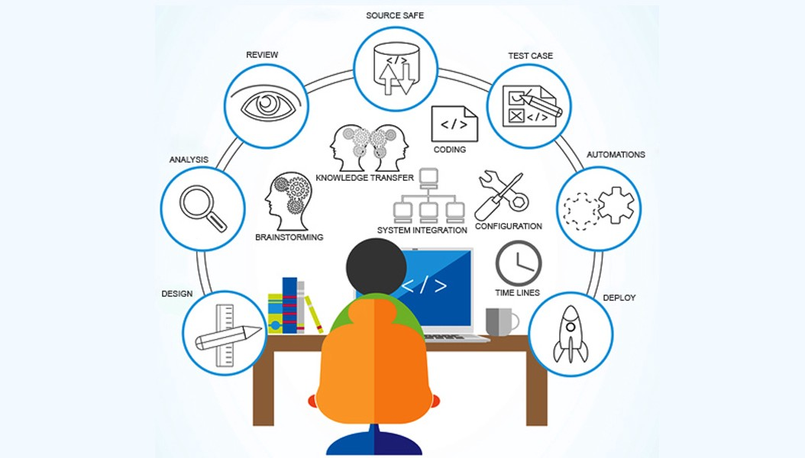

# Awesome Testing Tools 

	

> Software testing tools for automated, load, mobile, penetration, test observability, Web3/blockchain, accessibility, and contract testing.

## Contents

- [Automated Testing Tools](#automated-testing-tools)
- [Load Testing Tools](#load-testing-tools)
- [Mobile Testing Tools](#mobile-testing-tools)
- [Penetration Testing Tools](#penetration-testing-tools)
- [Test Observability Tools](#test-observability-tools)
- [Web3 and Blockchain Testing Tools](#web3-and-blockchain-testing-tools)
- [Accessibility Testing Tools](#accessibility-testing-tools)
- [Contract Testing Tools](#contract-testing-tools)

## Automated Testing Tools

- [Athena](https://athena-oss.github.io/) - Automation platform with a plugin architecture that allows you to easily create and share services.
- [Ava](https://github.com/avajs/ava) - Test runner for Node.js with a concise API, detailed error output, embrace of new language features and process isolation that let you write tests more effectively. So you can ship more awesome code.
- [BitDive](https://bitdive.io/) - Zero-code API testing platform for Java/Kotlin. Captures runtime behavior (HTTP, SQL, methods), auto-generates mocks from real traffic, and enables Live Context Replay for regression testing and debugging.
- [BugBug](https://bugbug.io) - Lightweight test automation tool designed exclusively for web applications. It uses a Chrome extension to record and playback tests. It's free, you only need to pay if you want to schedule cloud monitoring or integrate it with your CI/CD pipelines.
- [Caqui](https://douglasdcm.github.io/caqui/) - Executes commands against Drivers synchronously and asynchronously. The intention is that the user does not worry about which Driver they're using. It can be WebDrivers like Selenium, MobileDrivers like Appium, or DesktopDrivers like Winium.
- [Checkbot](https://www.checkbot.io/) - Browser extension. Tests your site follows 50+ SEO, speed and security best practices. Finds broken links, insecure pages, redirect chains, duplicate content and more. Crawls your site checking multiple pages at once.
- [CodeceptJS](https://codecept.io/) - E2E testing framework with a special unificated BDD-style syntax for different frameworks.
- [Cucumber](https://docs.cucumber.io/) - Open-source tool that supports Behaviour-Driven Development (BDD). The tests are written in [Gherkin](https://docs.cucumber.io/gherkin/). Cucumber integrates nicely with Selenium WebDriver, Serenity BDD, Watir and Capybara.
- [Cypress](https://www.cypress.io/) - JavaScript End-to-End testing framework. It allows you to run e2e tests effortlessly (no need to do a Java/Selenium setup in order to use it) with features such as debugging with Chrome DevTools and screenshots for tests run headlessly. The documentation is good and comes with many examples.
- [GoCodeo](https://www.gocodeo.com) - Your ultimate AI-powered extension for coding and testing in Visual Studio Code. Generate production-ready code and tests in seconds, and leverage the power of the latest AI models, including cutting-edge Large Language Models (LLMs) like Claude Sonnet 3.5, GPT - 4o, GPT - 4o mini, Gemini 1.5 Flash, Gemini 1.5 Pro, without any cost.
- [GoConvey](https://github.com/smartystreets/goconvey) - Behavior-driven development(BDD)-style testing framework that supports the go test command. It uses an expressive domain-specific language (DSL) that facilitates the creation of self-documenting, highly readable tests.
- [Guara](https://guara.readthedocs.io/en/latest/) - Guará is a Python framework designed to simplify UI test automation. Inspired by design patterns like Page Objects, App Actions, and Screenplay, Guará focuses on Page Transactions—encapsulating user interactions (transactions) on web pages, such as Login, Logout, or Form Submissions. It’s not just a tool; it’s a programming pattern that can be adapted to any web driver.
- [Gwirian](https://www.gwirian.com/) - Open source BDD test management platform for QA teams. Create and organize features, define scenarios in Given/When/Then format, and track execution status—with full-text search, dashboards, and a modern UI. Self-host for free or try the hosted app.
- [Happo](https://happo.io) - Cross-browser screenshot and visual regression testing service, with integrations for popular tools such as Storybook, Playwright, and Cypress.
- [HttpMaster](https://www.httpmaster.net/) - GUI tool for HTTP testing and debugging.
- [Instancio](https://www.instancio.org/) - Open-source library for automating data setup in unit tests. It can create fully-populated POJOs with a single method call. Instancio can be used with any testing framework. It also provides a JUnit 5 extension.
- [Jest](https://jestjs.io/) - Open-source JavaScript testing framework, written in TypeScript and developed by Facebook. It supports testing with Babel, TypeScript, Node, React, Angular, Vue and much more!
- [Jumpstarter](https://github.com/jumpstarter-dev/jumpstarter) - A hardware-in-the-loop testing framework for cloud-native CI/CD pipelines.
- [JUnit](https://junit.org/) - Open-source unit testing framework for the Java programming language. JUnit has been important in the development of test-driven development and is one of a family of unit testing frameworks which is collectively known as xUnit.
- [Karate](https://github.com/karatelabs/karate) - Open-source tool to combine API test-automation, mocks, performance-testing and even UI automation into a single, unified framework. The BDD syntax popularized by Cucumber is language-neutral, and easy for even non-programmers. Assertions and HTML reports are built-in, and you can run tests in parallel for speed.
- [Karma](https://karma-runner.github.io) - Can also watch your development files for changes and re-run the tests automatically. Karma lets us run Jasmine tests as part of a development tool chain which requires tests to be runnable and results inspectable via the command line. It's not necessary to know the internals of how Karma works.
- [Katalon Studio](https://www.katalon.com/) - Powerful test automation solution for web application, mobile, and web services. Being built on top of the Selenium and Appium frameworks, Katalon Studio takes advantage of these solutions for integrated software automation.
- [kogiQA](https://kogiqa.com/) - UI automation tool that works without selectors, so one can simply type `page.click('Submit')` it just has to match the meaning you see on the page.
- [LambdaTest](https://www.lambdatest.com/) - Cloud-based cross-browser testing platform that allows you to test your website or web application on 2000+ real browsers and operating systems. It is a fully managed platform that requires no setup or maintenance.
- [Mocha](https://mochajs.org/) - Open-source JavaScript Testing Framework that runs on Node.js.
- [MockHero](https://mockhero.dev) - REST API for generating synthetic test data. 156 field types, 22 locales, relational data, sub-50ms responses. Free tier: 1,000 records/day.
- [Mockito](https://site.mockito.org) - Mocking framework that lets you write tests with a clean & simple API. Mockito's tests are very readable and they produce clean verification errors.
- [Nightwatch.js](https://nightwatchjs.org/) - Integrated framework for performing automated end-to-end testing on web applications and websites, across all major browsers. It is written in Node.js and uses the W3C WebDriver API to interact with various browsers.
- [Panaya Test Dynamix](https://www.panaya.com/testing/) - With Test Dynamix, you can quickly manage tests with automatic workflows, easy documentation, real-time analytics, and smart change analysis.
- [PestPHP](https://pestphp.com/) - The elegant PHP testing framework. Pest is a testing framework with a focus on simplicity, meticulously designed to bring back the joy of testing in PHP.
- [Phpstan](https://phpstan.org) - Focuses on finding errors in your code without actually running it. It catches whole classes of bugs even before you write tests for the code. It moves PHP closer to compiled languages in the sense that the correctness of each line of the code can be checked before you run the actual line.
- [PhpUnit](https://phpunit.de/) - Unit testing framework for the PHP programming language. It is an instance of the xUnit architecture for unit testing frameworks that originated with SUnit and became popular with JUnit.
- [Playwright](https://playwright.dev/) - Framework for end-to-end testing of web applications. The framework supports writing tests in a variety of languages.
- [Psalm](https://psalm.dev) - Static analysis tool for finding errors in PHP applications, built on top of PHP Parser.
- [Puppetry](https://puppetry.app/) - Open-source scriptless test automation tool built on top of Google's Puppeteer. It can be used by QA engineers with no programming background. Puppetry can also export the tests into a Jest.js project, so they can be included into CI/CD pipeline.
- [ReadyAPI](https://smartbear.com/product/ready-api) - Paid tool owned by Smartbear. It is used for testing API's. It is built on top of SOAPUI. So it has all the features of SOAPUI and additional features such as support for data-driven testing, SCM friendly project structure, and better assertion capabilities. ReadyAPI is a no-code platform, but it supports JavaScript and Groovy as scripting languages to implement unforeseen functionality.
- [Robot Framework](https://robotframework.org/) - Open-source automation framework that implements the keyword-driven approach for acceptance testing and acceptance test-driven development (ATDD). Robot Framework provides frameworks for different test automation needs. But its test capability can be further extended by implementing additional test libraries.
- [Selenium](https://www.selenium.dev/downloads/) - Automates browsers. That's it! What you do with that power is entirely up to you. Primarily, it is for automating web applications for testing purposes, but is certainly not limited to just that. Boring web-based administration tasks can (and should!) be automated as well.
- [SilkTest](https://www.microfocus.com/en-us/products/silk-test/overview) - Test automation for web, mobile, rich-client, and Enterprise applications.
- [Squish](https://www.qt.io/product/quality-assurance/squish) - The GUI Testing Tool for automated functional regression and system testing. Squish supports of all kinds of cross-platform desktop, mobile, embedded and web applications.
- [Telerik](https://www.telerik.com/) - The complete test automation solution for GUI, Performance, Load and API testing.Test web, mobile and desktop applications.
- [TestCafé](https://testcafe.io/) - Open-source cross browser end-to-end functional test automation solution for web application. It is a JS based project, and run test suites on any popular browser without adding any additional code.
- [Test-proxy-recorder](https://github.com/asmyshlyaev177/test-proxy-recorder) - VCR-style record/replay of real API, SSR & WebSocket traffic for deterministic Playwright tests.
- [TestComplete](https://smartbear.com/) - Create complex and scalable automated UI functional tests in seconds with Record & Playback capabilities. With TestComplete you can trust your recorded tests will always play back - powered by the most accurate and customizable object repository, with 1k Rules Covering 50k properties & 500 controls.
- [Testim](https://www.testim.io/) - Modern day automated testing tool. It uses machine learning to speed the authoring, execution, and maintenance of automated tests. The tester can be analysis any test case in few minutes and execute them on multiple web and mobile platforms.
- [testomat.io](https://testomat.io/) - Modern TCMS allows sync the manual and automated tests in one place. Real-time reporting. Rich analytics dashboard with value testing metrics.
- [The Testing Library](https://testing-library.com/) - Set of helpers that let you test several frameworks, including React, Angular, Vue and their components without relying on their implementation details. This approach makes refactoring a breeze and also nudges you towards best practices for accessibility.
- [Unified Functional Testing](https://www.opentext.com/products/uft-one) - Cross-browser and multi-platform, Optimized distributed testing, Visual test flows (canvas), Multi-testing solution, Image-based object recognition.
- [vREST NG](https://vrest.io) - Zero code API automation solution for functional and regression testing of your APIs. It will help you to efficiently develop your test suites using record/replay, excel sheets (data driven testing) and allow you to derive your API testing using Swagger or OpenAPI specs.
- [Watir](http://watir.com/) - Open-source cross-platform web application testing tool. It is most reliable and flexible automation tool of Ruby libraries for web browsers automation. This cross browser testing tool interacts with a browser just like human being so it clicks links, filling out forms and validating text.
- [WHITE](https://github.com/TestStack/White) - Open-source, written in C# and it supports all rich client applications, which are Win32, WinForm, WPF and SWT (Java). It is .NET based and does not require the use of any proprietary scripting languages.
- [Wopee.io](https://wopee.io/) - Autonomous testing platform that uses visual AI to automatically validate web applications. It integrates with Playwright, Cypress, and other frameworks to provide visual regression testing, autonomous test maintenance, and AI-powered test result analysis.
- [Zato API Test](https://zato.io/) - API testing in pure English. No programming needed. Implemented and extendable in Python.
- [Zyntra](https://zyntra.app/) - Unlimited e-mail inboxes with API/UI access. Catch OTPs, reset links, and sign-up emails in your test flows.

## Load Testing Tools

- [ApacheBench](https://httpd.apache.org/docs/2.4/programs/ab.html) - Tool for benchmarking your Apache Hypertext Transfer Protocol (HTTP) server. It is designed to give you an impression of how your current Apache installation performs. This especially shows you how many requests per second your Apache installation is capable of serving.
- [BlazeMeter](https://www.blazemeter.com/) - Performance and Load Testing, 100% compatible with Apache JMeter™, 3rd party plugins, and advanced features. Control any aspect of your test in real time.
- [Gatling](https://gatling.io/) - Open-source load and performance testing framework based on Scala, Akka and Netty. It is known for it's high performance, ready-to-present HTML reports, scenario recorder and developer-friendly DSL.
- [Grafana K6](https://k6.io) - Open-source load testing tool that makes performance testing easy and productive for engineering teams. k6 is free, developer-centric, and extensible.
- [Jmeter](http://jmeter.apache.org/) - The Apache JMeter™ application is open source software, a 100% pure Java application designed to load test functional behavior and measure performance. It was originally designed for testing Web Applications but has since expanded to other test functions.
- [LoadUI](https://www.soapui.org/) - Scriptless Load Testing for REST & SOAP APIs.
- [Locust](https://locust.io/) - Define user behaviour with Python code, and swarm your system with millions of simultaneous users.
- [th2-loader](https://exactpro.com/test-tools/th2-loader) - Enterprise-grade load and simulation platform for exchanges, trading venues, market data systems, and post-trade infrastructures. It combines high-volume load generation, failover testing, production-data replay, protocol-aware simulation, and reconciliation to identify performance, resilience and correctness defects under realistic market stress. It supports FIX, ITCH, OUCH, FAST, REST, WebSocket, and proprietary protocols.
- [WAPT](https://www.loadtestingtool.com/) - Test the Performance of Web Applications Under Load.

## Mobile Testing Tools

- [Appium](http://appium.io/) - Open source test automation framework for use with native, hybrid and mobile web apps. It drives iOS, Android, and Windows apps using the WebDriver protocol.
- [Espresso](https://developer.android.com/training/testing/espresso) - Mobile testing tool for the enterprises. As an open-source tool, it's very easy to use, and it can extend within that working environment.
- [Experitest](https://experitest.com/) - Perform continuous web and mobile app testing to accelerate release cycles and increase quality.
- [FlyTrap](https://flytrap.dev/) - Exploratory testing agent that finds bugs, crashes, and UX issues in Android and iOS apps. Point it at a Play Store listing, TestFlight build, or app binary and it explores the app like a real tester, no scripts or setup needed. Findings are ready to file in Jira, Linear, and GitHub.
- [Maestro](https://www.mobile.dev/) - Simplest and most effective mobile(Android/iOS) UI testing framework.
- [React Native Testing Library](https://callstack.github.io/react-native-testing-library/) - The React Native Testing Library is a lightweight solution for testing React Native components. It provides light utility functions on top of react-test-renderer, in a way that encourages better testing practices.
- [Robolectric](http://robolectric.org/) - Open source test framework for Android. It provides faster unit-testing by running tests inside JVM.
- [Sherlo](https://github.com/sherlo-io/sherlo) - Visual testing platform for React Native Storybook. It captures screenshots on iOS and Android simulators in the cloud and detects visual changes automatically.

## Penetration Testing Tools

- [Aircrack-ng](https://www.aircrack-ng.org/) - Comprehensive collection of utilities for analyzing the weaknesses in a WiFi network. The tool allows you to monitor the security of your WiFi network by capturing data packets and exporting them to text files for further analysis. You can also verify the performance of WiFi cards through capture and injection.
- [Burp Suite](https://portswigger.net/burp/) - Graphical tool and integrated platform for testing Web application security. Its various tools work seamlessly together to support the entire testing process, from initial mapping and analysis of an application's attack surface, to finding and exploiting security vulnerabilities.
- [John-the-ripper](https://www.openwall.com/john/) - John the Ripper is an open source tool that cracks encryption and carries out brute force password attacks. It can crack passwords using lists of common words in over 20 languages, custom keyword lists, using mangling rules to try different variations of each word. It is a very robust tool that can run on a local machine for as long as needed to crack a set of passwords.
- [Kali Linux](https://www.kali.org/) - New generation of the industry-leading BackTrack Linux penetration testing and security auditing Linux distribution. Kali Linux is a complete re-build of BackTrack from the ground up, adhering completely to Debian development standards.
- [MetaSploit](https://www.metasploit.com/) - A collaboration between the open source community and Rapid7, Metasploit helps security teams do more than just verify vulnerabilities, manage security assessments, and improve security awareness; it empowers and arms defenders to always stay one step (or two) ahead of the game.
- [NetSparker](https://www.netsparker.com/) - Automatic, dead accurate and easy-to-use web application security scanner to automatically find security flaws in your websites, web applications and web services.
- [Nmap](https://nmap.org/) - An open-source network scanner with many features to discover what is available over the network including hosts, services and operating systems.
- [OWASP](https://www.owasp.org/) - The OWASP Zed Attack Proxy (ZAP) is one of the world's most popular free security tools and is actively maintained by hundreds of international volunteers*. It can help you automatically find security vulnerabilities in your web applications while you are developing and testing your applications. Its also a great tool for experienced pentesters to use for manual security testing.
- [ParrotOS](https://www.parrotsec.org/) - A lightweight security flavor of Debian Linux with a framework of security tools already installed.
- [Wireshark](https://www.wireshark.org/) - World's foremost and widely-used network protocol analyzer. It lets you see what's happening on your network at a microscopic level.

## Test Observability Tools

- [Datadog](https://www.datadoghq.com/) - Monitoring, security and analytics platform for developers, IT operations teams, security engineers and business users in the cloud age. Datadog's SaaS platform integrates and automates infrastructure monitoring, application performance monitoring and log management to provide unified, real-time observability of their customers' entire technology stack. Datadog is used by organizations of all sizes and across a wide range of industries to enable digital transformation and cloud migration, drive collaboration among development, operations, security and business teams, accelerate time to market for applications, reduce time to problem resolution, secure applications and infrastructure, understand user behavior and track key business metrics.
- [TestDino](https://testdino.com/) - Test observability platform that centralizes runs, errors, and coverage trends into one analytics dashboard, with flaky-test tracking, AI failure insights, and CI-aware views that cut debugging time, reduce flaky failures, and lower CI costs for growing automation suites.

## Web3 and Blockchain Testing Tools

- [Dapp.tools](https://dapp.tools/) - Command line tools and smart contract libraries for Ethereum smart contract development.
- [Foundry](https://github.com/foundry-rs/foundry) - Blazing fast, portable and modular toolkit for Ethereum application development written in Rust.
- [Ganache](https://trufflesuite.com/ganache/) - Personal Ethereum Blockchain which you can use to run tests, execute commands, and inspect state while controlling how the chain operates.
- [Hardhat](https://hardhat.org/) - Multichain Ethereum development environment.
- [Robot Framework Solidity Testing Toolkit](https://github.com/jg8481/Robot-Framework-Solidity-Testing-Toolkit) - This combines popular smart contract testing and deployment libraries with Robot Framework.
- [Truffle Suites](https://trufflesuite.com/) - Comprehensive suite of tools for smart contract development.

## Accessibility Testing Tools

Accessibility testing ensures that web applications and websites are usable by people with disabilities, in compliance with standards like WCAG 2.1/2.2 and regulations such as ADA, Section 508, and the European Accessibility Act.

- [axe DevTools](https://www.deque.com/axe/devtools/) - Industry-standard accessibility testing toolkit by Deque. Browser extension and CLI that checks against WCAG 2.2 standards. Powers accessibility testing in many CI/CD pipelines.
- [axe-core](https://github.com/dequelabs/axe-core) - An open-source accessibility testing engine for automated web UI testing. Created by Deque Systems, it powers many other accessibility tools and integrates with Selenium, Playwright, Cypress, and more.
- [Lighthouse](https://developer.chrome.com/docs/lighthouse) - An open-source automated tool by Google for improving the quality of web pages. Includes accessibility audits powered by axe-core alongside performance, SEO, and best practices checks. Built into Chrome DevTools.
- [Pa11y](https://pa11y.org/) - An open-source command-line accessibility testing tool that runs automated tests against web pages using HTML CodeSniffer and axe-core. Supports WCAG 2.1 AA/AAA and Section 508 standards, with multiple reporters and CI/CD integration.
- [RatedWithAI](https://ratedwithai.com/) - An AI-powered website accessibility scanner that checks against WCAG 2.2 and ADA standards. Provides instant compliance reports with actionable remediation steps. Supports single page scans and full site monitoring.
- [WAVE](https://wave.webaim.org/) - A suite of evaluation tools that helps authors make their web content more accessible to individuals with disabilities. Developed by WebAIM, it provides visual feedback about the accessibility of web content by injecting icons and indicators into the page.

## Contract Testing Tools

Contract testing becomes applicable as soon as you have two services that need to be communicated. It becomes crucial in microservices world, where multiple services have to interact with each other.

Following use cases could be valid for the contract testing in consumer and provider world:
- I'm a consumer of API and I don't want to test API manually.
- I'm API provider, and along with the unit test, I want to check whether my API adheres to contract, what to do?
- We are working in a distributed team and development goes hand in hand, how to share contract?

- [Beeceptor](https://beeceptor.com/) - Cloud based platform for API mocking, debugging, and traffic inspection that provides customizable endpoints for multi-protocol (HTTP, SOAP, GraphQL and gRPC) API services. It offers rule based request and state matching, error and latency simulations, CRUD and stateful mocking, and service virtualization using API specification formats, and offers various other features.
- [JsonSchema](https://json-schema.org/) - JSON Schema validates the structure and semantics of JSON data. It is a good fit for contract testing public APIs where you cannot control provider state (a case Pact cannot cover), and [validators](https://json-schema.org/tools) exist for many languages.
- [Pact](https://docs.pact.io/) - In Microservice era, managing contract between two services has become crucial part. Originally started by a development team at realestate.com.au, where they were trying to figure out how to write integration testing for their microservice architecture and later ended up as a [consumer driven contract testing](https://martinfowler.com/articles/consumerDrivenContracts.html) tool. Unlike a schema or specification, which is a static artifact that describes all possible states of a resource, a Pact contract is enforced by executing a collection of test cases, each of which describes a single concrete request/response pair - Pact is, in effect, "contract by example".
- [RestQA](https://github.com/restqa/restqa) - A REST API testing Framework based on Gherkin to manage microservice local testing using the best in class Developer experience.
- [Spiderhash](https://spiderhash.io/) - Webhook debugging and request inspection tool for capturing, inspecting, and troubleshooting inbound webhook deliveries with replay-friendly workflows for API integrations.
- [WireMock](https://wiremock.org/) - A popular, open-source tool and Java library for creating flexible mock multi-protocol APIs that allows developers to stub responses, verify requests, and inject faults for local testing. Also offers a paid cloud offering (WireMock Cloud), which is a managed, hosted version that adds an intuitive web UI, team collaboration, enterprise-grade features like chaos testing and API security, and unlimited scalability and usage.

## Contributing

Contributions welcome! Read the [contribution guidelines](contributing.md) first.
